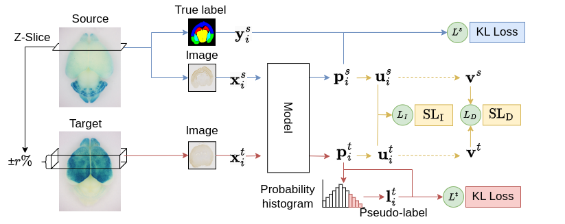

# Unsupervised Domain Adaptation with Structural Loss



# Project Organization

```
    ├── .github/           <- Settings for GitHub.
    │
    ├── data/              <- Datasets and image processing code (data Organization  is documented in "data/README.md")
    │
    ├── environments/      <- Provision depends on environments.
    │
    ├── models/            <- Pretrained and serialized models.
    │
    ├── notebooks/         <- No use
    │
    ├── outputs/           <- Outputs
    │
    ├── src/               <- Source code.
    │
    ├── tests/             <- No use
    │
    ├── .flake8
    ├── .dockerignore
    ├── .gitignore
    ├── LICENSE            <- Ascender LICENSE
    ├── Makefile           <- No use
    ├── poetry.lock        <- Lock file. DON'T edit this file manually.
    ├── poetry.toml        <- Setting file for Poetry.
    ├── pyproject.toml     <- Setting file for Project. (Poetry, Black, isort, Mypy)
    ├── main.py            <- main code (Train and Test)
    ├── prediction.py      <- Predictin code (Create Prediction images 512x512 pix)
    └── README.md          <- The top-level README for developers.

```

## Using template repository
+ https://github.com/cvpaperchallenge/Ascender　\
If there are any issues with the setup, a solution may be found at the above URL

# PC setting
 - OS:Ubuntu20.04LTS
 - CPU:Intel® Core™ i9-10900 CPU @ 2.80GHz × 20 
 - GPU: NVIDIA GeForce RTX 3090
 - Memory: 64GB

# SetUp
## Create accounts
 + install docker
 + create Wandb account from [here](https://www.wandb.jp/)
   + copy user name and API key (User Settings -> Danger Zone -> API keys)
 + create GitHub account from [here](https://github.co.jp/)
 + create figshare account from [here](https://figshare.com/)
 + HDF5 viewr feom [here](https://github.com/openssbd/QTBD5Viewer)


## Download code from github
```shell
UserNmae@yourPC: $ git clone git@github.com:tohsato-lab/S-loss.git
```

## Create docker container and install python3 virtual environment 
```shell
UserNmae@yourPC:S-loss $ cd environment/gpu
UserNmae@yourPC:S-loss $ docker compose up -d
UserNmae@yourPC:S-loss $ docker compose exec core bash
challenger@hoge:~/ascender $ poetry install
```
## Wandb setting
 + wandb setting in docker container
``` shell
challenger@hoge:~/ascender $ poetry run wandb init
Lets setup this directory for W&B!
wandb: Logging into wandb.ai. (Learn how to deploy a W&B server locally: https://wandb.me/wandb-server)
wandb: You can find your API key in your browser here: https://wandb.ai/authorize
wandb: Paste an API key from your profile and hit enter, or press ctrl+c to quit: {API key} 
...
Enter a name for your new project: {Project Name}

challenger@hoge:~/ascender $ poetry run wandb init
```
# Downloading datasets
+ Download label image and datatables from [here](https://figshare.com/account/home#/projects/190317)
+ Download NeuroGT Images with download_Neurogt.sh
```shell
UserNmae@yourPC:S-loss $ cd data
UserNmae@yourPC:S-loss/data $ bash download_Neurogt.sh
UserNmae@yourPC:S-loss/data $ bash download_Neurogt.sh


```

# Running
## Running Train and Test
 1. Edit main.py
``` python {main.py}
if __name__ == '__main__':
    CFG = get_args()
    if CFG.wandb_logging:
        run = wandb.init(
            project="{Project Name}",   # ← here
            config={k: v for k, v in dict(vars(CFG)).items() if '__' not in k},
            name=f"{CFG.Name}",
            entity="{User Name}"        # ← here
        )
        wandb.save(os.path.join(CFG.Homepath, 'src', 'train_core.py'))
    main_loop(CFG)
```
 2. Running main.py (Train and Test)
```shell
challenger@hoge:~ $ cd ~/ascender
challenger@hoge:~/ascender $ poetry run python3 main.py
```

## Running Prediction and Create BD5 dataset
 1. download model weight (hogehoge.pth) from wandb and save in " **models/** " folder
 2. Edit prediction.py 
```python
model = load_model.load_deplaboV3plus(configs=configs)
model_name = f'model_weight_name'                       # ←here (ex: hogehoge <-"hogehoge.pth")
model_path = os.path.join(configs.Homepath, "models", model_name + '.pth')
model.load_state_dict(torch.load(model_path))
```
 3. Running prediction.py
```shell
challenger@hoge:~/ascender $ poetry run python3 predinction.py
```
 4. Resizing and Create BD5
```shell
challenger@hoge:~/ascender $ cd data
challenger@hoge:~/ascender/data $ poetry run python3 resize.py
challenger@hoge:~/ascender/data $ poetry run python3 create_h5_split_class_id.py
```

# NeuroGT with HDF5 viewr

